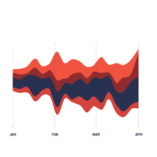

## Electricity Generation for US Population and Emisson Impact

Data is being gathered from the U.S. Energy Information Administration using their free API.  Database can be queried at the link below.
https://www.eia.gov/opendata/qb.php

Focus is going to be on building charts around the below datasets:
- Electricty Total Average Price

- Energy Production Totals, consist of:
    - Oil
    - Gas
    - Coal
    - Nuclear
    - Renewable Energy Sources

- Renewable Energy Production Totals, consist of:
    - Biomass
    - Hydropower
    - Geothermal
    - Wind
    - Solar
- Resident Populations
- Total CO2 Emissions All Sources

Data is going to be extracted from the API, stored in a SQLite, transformed into various vissualizations, and these visualizations will be easily manipulated on the HTML pages by the user to provide various views of this data. 

Visualizations will be built out using Ploty, Leaflet, heatmap.js, Streamgraph, and Mapbox

https://plot.ly/javascript/
https://leafletjs.com/
https://www.patrick-wied.at/static/heatmapjs/
https://www.d3-graph-gallery.com/streamgraph.html
https://www.mapbox.com/

Examples of charts:

